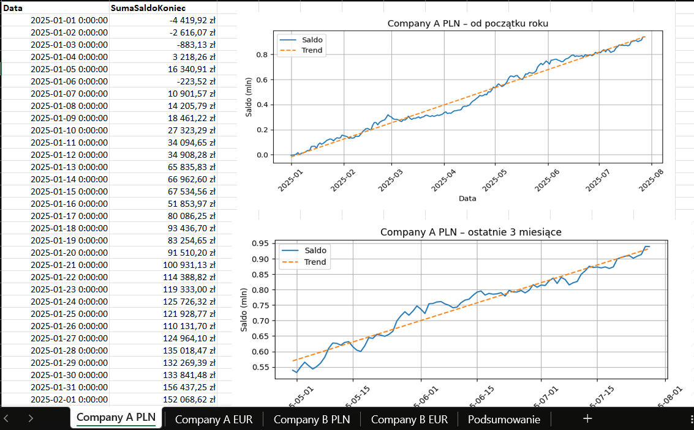
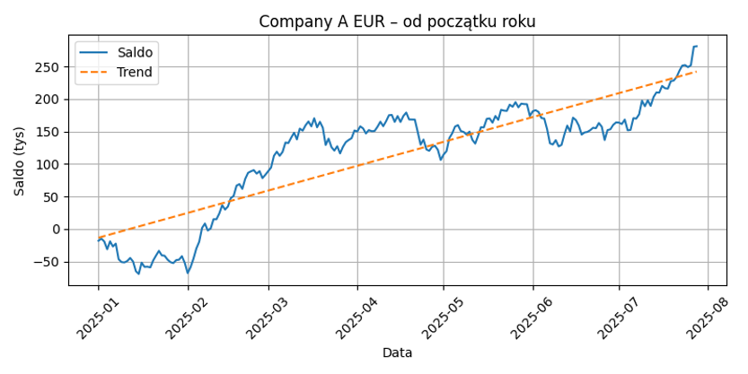

# Generator Sald Dziennych

Automatyczny generator raportu sald dziennych z kont bankowych dla wielu spółek i walut. 
Skrypt tworzy raport Excel (SaldoDzienny.xlsx) zawierający dane, wykresy trendów oraz arkusz podsumowujący.
Projekt oparty na Pythonie i bibliotece openpyxl oraz matplotlib.
---

## Funkcje

- Obsługuje wiele firm i walut (np. Company A / Company B, PLN / EUR)
- Generowanie danych (symulowanych) od początku roku
- Eksport do Excela z:
  - Arkuszami dla każdej firmy i waluty
  - Wykresami trendów sald (Trendy sald od początku roku i dla ostatnich 3 miesięcy) dla każdego konta
  - Zbiorczym arkuszem podsumowującym z łącznymi saldami

### Arkusz CompanyA PLN

### Wykres trendu sald EUR w CompanyA

### Wykres podsumowania PLN

